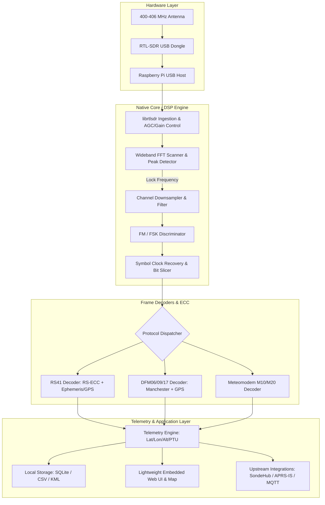
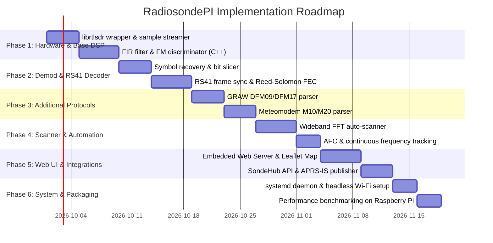

# RadiosondePI - System Architecture & Initial Plan

**Project:** Native Raspberry Pi Radiosonde Auto-Scanner & Telemetry Decoder  
**Target Hardware:** Raspberry Pi 3B+ / 4B / 5 / Zero 2W + RTL-SDR v3/v4  
**Primary Language/Runtime Stack:** C++20 (CMake build system) with ARM NEON acceleration, embedded REST/WebSocket server, and Leaflet.js web frontend.

---

## 1. System Architecture Overview

---

## 2. Technology Stack Selection

| Component | Recommended Choice | Rationale |
| :--- | :--- | :--- |
| **Core DSP & Decoding** | **C++20** with ARM NEON | Low latency, ARM NEON SIMD acceleration, zero-copy buffer processing, minimal CPU usage on Pi Zero 2W / Pi 3 / 4 / 5. |
| **SDR Interface** | `librtlsdr` (C API) | Standard low-level driver interface supporting asynchronous transfers (`rtlsdr_read_async`). |
| **Web UI & API** | Embedded HTTP/WebSocket Server (`cpp-httplib`) + Leaflet.js | Headless operation, real-time live map tracking, accessible via local Wi-Fi / hotspot in the field. |
| **Database / Storage** | SQLite + Flat JSON logs | Zero-configuration, atomic writes, easy file export. |

---

## 3. Core Functional Modules

### A. SDR Ingestion & Spectrum Scanner
* **Wideband Sweep Mode**: Steps across the meteorological band ($400.05 \text{ MHz}$ to $406.00 \text{ MHz}$) in $1.0\text{–}2.4\text{ MHz}$ chunks, performing fast windowed FFTs to detect active signal peaks above noise floor.
* **Tracking & Automatic Frequency Control (AFC)**: Tracks carrier frequency drift and Doppler shift, continuously fine-tuning center frequency or applying digital baseband shift.

### B. DSP & Demodulation Pipeline
* **Decimation & Channel Filtering**: Polyphase FIR low-pass filter downsampling raw I/Q from $2.4\text{ MSPS}$ to $\approx 48\text{–}96\text{ kSPS}$.
* **Demodulation**: Fast atan2-based FM polar discriminator:
  $$\Delta \theta[n] = \arg(I[n] + jQ[n]) - \arg(I[n-1] + jQ[n-1])$$
* **Clock Recovery**: Gardner or zero-crossing symbol synchronizer to reliably lock symbol timing and slice bits from noisy FSK/GFSK signals.

### C. Protocol Decoders & Error Correction
* **Vaisala RS41**:
  * 4800 baud GFSK, Manchester/NRZ, 64-bit sync frame (`0x10B583FF08AD`), Reed-Solomon $(255, 231)$ FEC.
  * GPS position calculation, sensor data (temperature, relative humidity, pressure).
* **GRAW DFM-06 / DFM-09 / DFM-17**:
  * 2400 baud FSK, Manchester encoded, de-interleaving, CRC check.
* **Meteomodem M10 / M20**:
  * 9600 baud GFSK, differential Manchester, GPS and PTU parsing.

### D. Telemetry & Export Engine
* **Coordinate Calculations**: Altitude, ascent/descent vertical speed, horizontal velocity, heading.
* **PTU Derivations**: Dew point, potential temperature, air pressure from altitude profiles.
* **Predictive Descent**: Landing predictor using local wind vectors or NOAA GFS wind trajectory models.
* **Upstream Forwarding**:
  * **SondeHub v2 Tracker API** (direct submission for global balloon tracking network).
  * **APRS-IS** beaconing for amateur radio chase networks.
  * **MQTT** message publisher for local Home Assistant / IoT integration.

---

## 4. Implementation Phases

---

## 5. Raspberry Pi Specific Optimizations

1. **SIMD Acceleration**: Utilize ARM NEON intrinsics for vector dot-products in FIR filtering and FFT calculations (`FFTW3` with NEON or `liquid-dsp`).
2. **Memory Footprint**: Circular ring buffers with DMA-backed USB bulk transfers via `librtlsdr` to prevent buffer overruns during high CPU load.
3. **Multi-Threading Model**:
   * **Thread 1 (Priority Real-Time)**: USB I/Q acquisition & downsampling.
   * **Thread 2 (DSP)**: Demodulation, symbol sync, and framing.
   * **Thread 3 (Async I/O)**: Web UI, SQLite persistence, and network telemetry uplinks.
4. **Thermal & Power Efficiency**: Sleep SDR sampling when no active sonde is tracked during auto-scan intervals to reduce thermal throttling on Pi 3/4.
