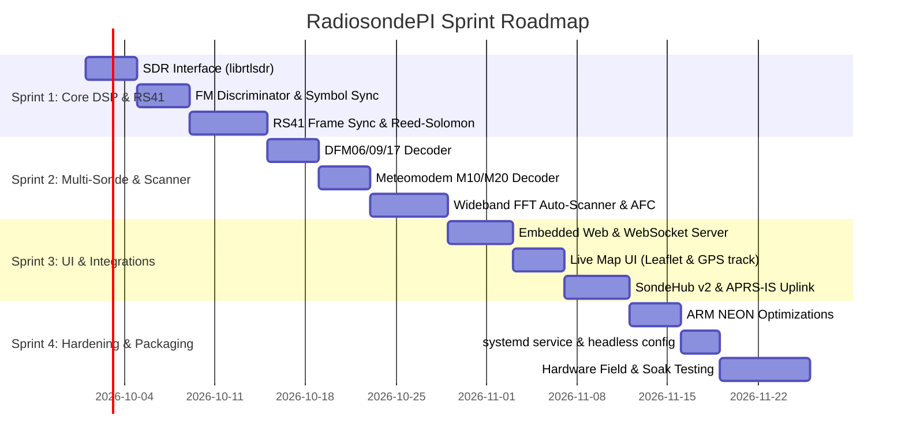

# RadiosondePI - Sprint Roadmap & Execution Plan

**Project:** Native Raspberry Pi Radiosonde Auto-Scanner & Telemetry Decoder  
**Target Hardware:** Raspberry Pi 3B+ / 4B / 5 / Zero 2W + RTL-SDR v3/v4  
**Primary Language/Runtime Stack:** C++20 (CMake build system) with ARM NEON acceleration, embedded REST/WebSocket server, and Leaflet.js web frontend.

---

## 🎯 Sprint Overview

---

## 🏃 Sprint 1: Core Ingestion, Demodulation & Vaisala RS41 Decoder
**Duration:** 2 Weeks  
**Primary Goal:** Ingest raw I/Q from RTL-SDR at 2.4 MSPS, downsample to channel rate, demodulate 4800 baud GFSK, and decode raw telemetry frames from a Vaisala RS41 radiosonde.

### User Stories & Tasks
- [x] **SPI-101: RTL-SDR Acquisition Module (5 SP)**
  - Integrate `librtlsdr` with asynchronous ring buffer (`rtlsdr_read_async`).
  - Implement configurable tuner parameters (center freq, manual/hardware gain, AGC, PPM correction).
  - Add thread-safe lockless ring buffer for raw I/Q streaming to DSP thread.
- [x] **SPI-102: Channel Filter & Decimation Pipeline (5 SP)**
  - Implement Polyphase FIR lowpass filter (decimation from 2.4 MSPS to 48 kSPS).
  - Implement atan2-based Polar FM Discriminator for frequency deviation extraction.
- [x] **SPI-103: Symbol Clock Recovery & Slicer (5 SP)**
  - Implement zero-crossing / Gardner timing error detector (TED) for 4800 baud recovery.
  - Hard bit-slicing and bitstream circular shift register.
- [x] **SPI-104: Vaisala RS41 Protocol Engine (8 SP)**
  - Implement 64-bit frame sync detection (`0x10B583FF08AD`).
  - Implement Reed-Solomon $(255, 231)$ error correction & de-whitening PRBS-15 sequence.
  - Parse sub-blocks: GPS ECEF coordinates / velocity, frame counter, serial number, temperature, relative humidity.
- [x] **SPI-105: CLI Output & Unit Tests (3 SP)**
  - Output parsed telemetry to stdout (JSON format).
  - Unit tests for Reed-Solomon FEC and known raw RS41 capture sample validation.

---

## 🏃 Sprint 2: Multi-Protocol Decoders & Wideband Auto-Scanner
**Duration:** 2 Weeks  
**Primary Goal:** Expand protocol coverage to GRAW DFM and Meteomodem M10/M20, and implement automatic spectrum scanning across 400.05–406.00 MHz.

### User Stories & Tasks
- [x] **SPI-201: GRAW DFM-06 / DFM-09 / DFM-17 Decoder (5 SP)**
  - Manchester decoding at 2400 baud.
  - De-interleaving matrix, CRC-16 validation, and GPS NMEA / PTU payload extraction.
- [x] **SPI-202: Meteomodem M10 / M20 Decoder (5 SP)**
  - 9600 baud GFSK demodulation and Differential Manchester decoding.
  - Frame structure parsing for GPS coordinates and pressure/temperature sensor data.
- [x] **SPI-203: Wideband FFT Auto-Scanner (8 SP)**
  - Sweep 400.05 MHz to 406.00 MHz in 1.8 MHz stepped hops.
  - Compute windowed FFT (Hanning/Blackman) and detect sustained spectral peaks $> 8\text{ dB}$ SNR.
  - Automatically tune to active peak frequency and hand off to protocol auto-identifier.
- [x] **SPI-204: Automatic Frequency Control (AFC) (3 SP)**
  - Continuous DC carrier offset estimator to track sonde crystal temperature drift during ascent.

---

## 🏃 Sprint 3: Live Web UI, Mapping & Telemetry Uplinks
**Duration:** 2 Weeks  
**Primary Goal:** Provide a responsive web interface with real-time mapping and cloud balloon tracking network submission.

### User Stories & Tasks
- [x] **SPI-301: Embedded Web & WebSocket Server (5 SP)**
  - Lightweight embedded HTTP server (`cpp-httplib` / WebSocket).
  - Broadcast live telemetry frames at 1 Hz to connected browser clients.
  - REST endpoints for scanner control, manual tuning, and SDR gain adjustment.
- [x] **SPI-302: Responsive Web UI & Leaflet Map (5 SP)**
  - OpenStreetMap / Leaflet.js real-time flight path tracker.
  - Display altitude profile, ascent rate, ground speed, PTU graphs, and receiver station position.
  - Estimated landing location prediction using current wind vectors.
- [x] **SPI-303: SondeHub v2 API Uplink (5 SP)**
  - HTTP PUT client for submitting telemetry payloads to `https://api.v2.sondehub.org/sondes/telemetry`.
  - Configurable amateur callsign, station antenna, and GPS coordinates.
- [x] **SPI-304: APRS-IS & MQTT Gateway (3 SP)**
  - APRS packet generation and socket connection to `rotate.aprs2.net:14580`.
  - Local MQTT broker publishing for Home Assistant integration.

---

## 🏃 Sprint 4: ARM Optimization, Packaging & Field Validation
**Duration:** 2 Weeks  
**Primary Goal:** Maximize power/CPU efficiency on Raspberry Pi hardware, create daemon installation packages, and conduct live field tracking.

### User Stories & Tasks
- [x] **SPI-401: ARM NEON SIMD Optimizations (5 SP)**
  - Optimize FIR filtering and complex multiply operations with NEON intrinsics.
  - Benchmark CPU utilization on Raspberry Pi Zero 2W / Pi 4 (target: $< 25\%$ single core load).
- [x] **SPI-402: SQLite Flight Logger & KML/CSV Export (3 SP)**
  - Persist all received packets into local SQLite database indexed by sonde serial number.
  - One-click KML / GPX / CSV export for GIS and post-flight analysis.
- [x] **SPI-403: systemd Service & Debian Packaging (3 SP)**
  - `radiosondepi.service` for automatic start on boot.
  - Generate standalone `.deb` package or Docker container image.
- [x] **SPI-404: Live Balloon Chase & Field Soak Test (5 SP)**
  - Live over-the-air validation during actual synoptic meteorological balloon launches (00:00 / 12:00 UTC).
  - Test antenna configurations, low-noise amplifiers (LNA), and headless Wi-Fi hotspot mode.
